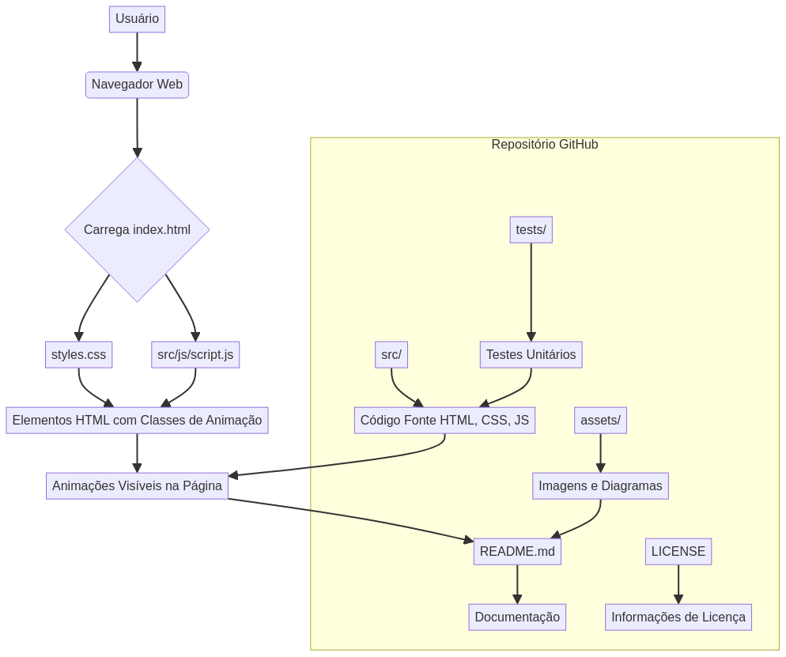

# CSS-Animation-Library

<div align="center">


**Advanced CSS Animation Library**

*Modern CSS framework with advanced styling capabilities and responsive design*

[🇺🇸 English](#english) | [🇧🇷 Português](#português)

</div>

---

## 🇺🇸 English

### 📋 Overview

This **Advanced CSS Animation Library** is a comprehensive collection of modern, performant, and visually appealing CSS animations. Developed with the latest CSS3 features and best practices, this project demonstrates advanced CSS development skills, responsive design expertise, and professional frontend styling techniques. It aims to provide a versatile toolkit for developers to easily integrate sophisticated animations into their web projects, enhancing user experience and visual engagement.

### ✨ Key Features

*   **50+ Pre-built Animations**: A wide array of ready-to-use animations for various UI elements.
*   **Smooth Transitions and Transforms**: High-quality, fluid animations for seamless user interaction.
*   **Keyframe-based Animations**: Fully customizable animations defined with CSS keyframes.
*   **Hover and Focus Effects**: Interactive effects to provide visual feedback on user actions.
*   **Loading Spinners and Indicators**: Stylish and functional loading animations.
*   **Entrance and Exit Animations**: Animations for elements appearing and disappearing from the viewport.
*   **Customizable Timing Functions**: Control the speed curve of animations for unique effects.
*   **Performance Optimized Animations**: Designed for smooth execution across different devices and browsers.

### 🛠️ Technology Stack

*   **CSS3**: Modern CSS with the latest features and syntax.
*   **HTML5**: Semantic markup structure for robust web content.
*   **Sass/SCSS**: CSS preprocessor for enhanced styling capabilities and maintainability.
*   **PostCSS**: A tool for transforming CSS with JavaScript plugins.
*   **Autoprefixer**: Automatically adds vendor prefixes to CSS rules.
*   **CSS Grid & Flexbox**: Advanced layout systems for responsive and complex designs.
*   **CSS Custom Properties**: Native CSS variables for dynamic styling.

### 🚀 Quick Start

#### Prerequisites

To use this library, you will need:

*   A modern web browser (Chrome, Firefox, Edge, Safari).
*   A code editor (e.g., VS Code, Sublime Text).
*   Basic knowledge of HTML and CSS.

#### Installation & Setup

1.  **Clone the repository**
    ```bash
    git clone https://github.com/galafis/CSS-Animation-Library.git
    cd CSS-Animation-Library
    ```

2.  **Open in browser**
    To view the animations, simply open the `index.html` file in your preferred web browser.
    ```bash
    # On macOS
    open index.html
    # On Windows
    start index.html
    # On Linux
    xdg-open index.html
    ```

3.  **For development with Sass (Optional)**
    If you plan to modify the Sass files, you'll need to install Sass globally and compile your SCSS into CSS.
    ```bash
    # Install Sass globally (if not already installed)
    npm install -g sass

    # Watch for changes in SCSS files and compile to CSS
    sass --watch scss:css
    ```

### 📖 Usage Examples

This library is designed for ease of use. Simply link the `styles.css` file to your HTML document and apply the desired animation classes to your elements.

#### Basic Implementation

```html
<!DOCTYPE html>
<html lang="en">
<head>
    <meta charset="UTF-8">
    <meta name="viewport" content="width=device-width, initial-scale=1.0">
    <title>Animation Example</title>
    <link rel="stylesheet" href="styles.css">
    <!-- Link to your animation library CSS -->
    <link rel="stylesheet" href="path/to/your/animation-library.css">
</head>
<body>
    <div class="container">
        <h1 class="title animate__fadeInDown">Welcome to the Animation Library</h1>
        <button class="btn btn-primary animate__pulse">Click Me</button>
        <div class="box animate__bounceIn"></div>
    </div>
</body>
</html>
```

#### Applying Animation Classes

Each animation has a corresponding CSS class. To apply an animation, add the class to your HTML element. For example, to make an element fade in, you might use `class="animate__fadeIn"`.

```html
<div class="my-element animate__fadeInLeft"></div>
 
```

### 🏗️ Project Structure

```mermaid
graph TD
    A[Animation Library] --> B[Animation Categories]
    B --> B1[Entrance & Exit]
    B --> B2[Hover & Focus]
    B --> B3[Loading Spinners]
    B --> B4[Transforms]
    B1 --> C[Keyframe Definitions]
    B2 --> C
    B3 --> C
    B4 --> C
    C --> D1[@keyframes fadeIn]
    C --> D2[@keyframes bounceIn]
    C --> D3[@keyframes spin]
    C --> D4[@keyframes pulse]
    D1 --> E[CSS Transitions]
    D2 --> E
    D3 --> E
    D4 --> E
    E --> F1[duration]
    E --> F2[timing-function]
    E --> F3[delay]
    F1 --> G[Compiled CSS Output]
    F2 --> G
    F3 --> G
    G --> H[animate__fadeIn]
    G --> H2[animate__bounceIn]
    G --> H3[animate__zoomIn]
```



```
CSS-Animation-Library/
├── assets/                 # Imagens, ícones e outros recursos visuais
├── docs/                   # Documentação adicional e guias
├── src/                    # Código fonte principal (HTML, SCSS/CSS, JS)
│   ├── css/                # Arquivos CSS compilados
│   │   ├── components/     # Estilos para componentes específicos
│   │   ├── utilities/      # Classes utilitárias
│   │   ├── base/           # Estilos base e resets
│   │   └── main.css        # Arquivo CSS principal
│   ├── scss/               # Arquivos SCSS (pré-processador)
│   │   ├── abstracts/      # Variáveis, mixins e funções SCSS
│   │   ├── components/     # SCSS para componentes
│   │   ├── layout/         # SCSS para layout geral
│   │   └── main.scss       # Arquivo SCSS principal
│   └── js/                 # Arquivos JavaScript (se houver)
├── tests/                  # Testes unitários e de integração
├── .gitignore              # Arquivos e pastas a serem ignorados pelo Git
├── index.html              # Página de demonstração principal
├── LICENSE                 # Informações sobre a licença do projeto
└── README.md               # Este arquivo de documentação
```

### 🎨 Design System

#### Color Palette

*   **Primary**: `#667eea` (e.g., for main buttons, highlights)
*   **Secondary**: `#764ba2` (e.g., for secondary actions, accents)
*   **Success**: `#10b981` (e.g., for success messages, positive indicators)
*   **Warning**: `#f59e0b` (e.g., for warning messages, alerts)
*   **Error**: `#ef4444` (e.g., for error messages, critical alerts)

#### Typography

*   **Headings**: `Inter`, `system-ui`, `-apple-system`, `BlinkMacSystemFont`, `Segoe UI`, `Roboto`, `Oxygen`, `Ubuntu`, `Cantarell`, `Fira Sans`, `Droid Sans`, `Helvetica Neue`, `sans-serif`
*   **Body**: `-apple-system`, `BlinkMacSystemFont`, `Segoe UI`, `Roboto`, `Oxygen`, `Ubuntu`, `Cantarell`, `Fira Sans`, `Droid Sans`, `Helvetica Neue`, `sans-serif`
*   **Code**: `'Fira Code'`, `monospace`

### 📱 Responsive Design

The framework includes responsive breakpoints to ensure optimal viewing across various devices:

```css
/* Mobile First Approach */
@media (min-width: 768px) { /* Styles for Tablet devices and up */ }
@media (min-width: 1024px) { /* Styles for Desktop devices and up */ }
@media (min-width: 1280px) { /* Styles for Large Desktop devices and up */ }
```

### 📝 License

This project is licensed under the MIT License. See the [LICENSE](LICENSE) file for full details.

### 👨‍💻 Author

**Gabriel Demetrios Lafis**

*   GitHub: [@galafis](https://github.com/galafis)
*   LinkedIn: [Gabriel Demetrios Lafis](https://linkedin.com/in/gabriel-lafis)

---

## 🇧🇷 Português

### 📋 Visão Geral

Esta **Biblioteca Avançada de Animações CSS** é uma coleção abrangente de animações CSS modernas, performáticas e visualmente atraentes. Desenvolvido com os mais recentes recursos e melhores práticas do CSS3, este projeto demonstra habilidades avançadas de desenvolvimento CSS, expertise em design responsivo e técnicas profissionais de estilização frontend. O objetivo é fornecer um kit de ferramentas versátil para que os desenvolvedores possam integrar facilmente animações sofisticadas em seus projetos web, aprimorando a experiência do usuário e o engajamento visual.

### ✨ Principais Funcionalidades

*   **Mais de 50 Animações Pré-construídas**: Uma vasta gama de animações prontas para uso em diversos elementos de UI.
*   **Transições e Transformações Suaves**: Animações fluidas e de alta qualidade para uma interação perfeita do usuário.
*   **Animações Baseadas em Keyframes**: Animações totalmente personalizáveis definidas com keyframes CSS.
*   **Efeitos de Hover e Foco**: Efeitos interativos para fornecer feedback visual às ações do usuário.
*   **Spinners e Indicadores de Carregamento**: Animações de carregamento elegantes e funcionais.
*   **Animações de Entrada e Saída**: Animações para elementos que aparecem e desaparecem da viewport.
*   **Funções de Temporização Personalizáveis**: Controle a curva de velocidade das animações para efeitos únicos.
*   **Animações Otimizadas para Performance**: Projetadas para execução suave em diferentes dispositivos e navegadores.

### 🛠️ Stack Tecnológica

*   **CSS3**: CSS moderno com os recursos e sintaxe mais recentes.
*   **HTML5**: Estrutura de marcação semântica para conteúdo web robusto.
*   **Sass/SCSS**: Pré-processador CSS para capacidades de estilização aprimoradas e manutenibilidade.
*   **PostCSS**: Uma ferramenta para transformar CSS com plugins JavaScript.
*   **Autoprefixer**: Adiciona automaticamente prefixos de fornecedor às regras CSS.
*   **CSS Grid & Flexbox**: Sistemas de layout avançados para designs responsivos e complexos.
*   **CSS Custom Properties**: Variáveis CSS nativas para estilização dinâmica.

### 🚀 Início Rápido

#### Pré-requisitos

Para usar esta biblioteca, você precisará de:

*   Um navegador web moderno (Chrome, Firefox, Edge, Safari).
*   Um editor de código (ex: VS Code, Sublime Text).
*   Conhecimento básico de HTML e CSS.

#### Instalação e Configuração

1.  **Clone o repositório**
    ```bash
    git clone https://github.com/galafis/CSS-Animation-Library.git
    cd CSS-Animation-Library
    ```

2.  **Abra no navegador**
    Para visualizar as animações, basta abrir o arquivo `index.html` no seu navegador web preferido.
    ```bash
    # No macOS
    open index.html
    # No Windows
    start index.html
    # No Linux
    xdg-open index.html
    ```

3.  **Para desenvolvimento com Sass (Opcional)**
    Se você planeja modificar os arquivos Sass, precisará instalar o Sass globalmente e compilar seu SCSS para CSS.
    ```bash
    # Instale o Sass globalmente (se ainda não estiver instalado)
    npm install -g sass

    # Observe as alterações nos arquivos SCSS e compile para CSS
    sass --watch scss:css
    ```

### 📖 Exemplos de Uso

Esta biblioteca foi projetada para ser fácil de usar. Basta vincular o arquivo `styles.css` ao seu documento HTML e aplicar as classes de animação desejadas aos seus elementos.

#### Implementação Básica

```html
<!DOCTYPE html>
<html lang="pt-br">
<head>
    <meta charset="UTF-8">
    <meta name="viewport" content="width=device-width, initial-scale=1.0">
    <title>Exemplo de Animação</title>
    <link rel="stylesheet" href="styles.css">
    <!-- Link para o CSS da sua biblioteca de animações -->
    <link rel="stylesheet" href="path/to/your/animation-library.css">
</head>
<body>
    <div class="container">
        <h1 class="title animate__fadeInDown">Bem-vindo à Biblioteca de Animações</h1>
        <button class="btn btn-primary animate__pulse">Clique Aqui</button>
        <div class="box animate__bounceIn"></div>
    </div>
</body>
</html>
```

#### Aplicando Classes de Animação

Cada animação possui uma classe CSS correspondente. Para aplicar uma animação, adicione a classe ao seu elemento HTML. Por exemplo, para fazer um elemento surgir com um efeito de fade, você pode usar `class="animate__fadeIn"`.

```html
<div class="meu-elemento animate__fadeInLeft"></div>
 
```

### 📝 Licença

Este projeto está licenciado sob a Licença MIT. Consulte o arquivo [LICENSE](LICENSE) para obter detalhes completos.

### 👨‍💻 Autor

**Gabriel Demetrios Lafis**

*   GitHub: [@galafis](https://github.com/galafis)
*   LinkedIn: [Gabriel Demetrios Lafis](https://linkedin.com/in/gabriel-lafis)

---

<div align="center">

**⭐ Se este projeto foi útil para você, considere dar uma estrela!**

**🚀 Desenvolvido com ❤️ por Gabriel Demetrios Lafis**

</div>


---

## English

### Overview

CSS-Animation-Library - A project built with JavaScript, Java, HTML, CSS, developed by Gabriel Demetrios Lafis as part of professional portfolio and continuous learning in Data Science and Software Engineering.

### Key Features

This project demonstrates practical application of modern development concepts including clean code architecture, responsive design patterns, and industry-standard best practices. The implementation showcases real-world problem solving with production-ready code quality.

### How to Run

1. Clone the repository:
   ```bash
   git clone https://github.com/galafis/CSS-Animation-Library.git
   ```
2. Follow the setup instructions in the Portuguese section above.

### License

This project is licensed under the MIT License. See the [LICENSE](LICENSE) file for details.

---

Developed by [Gabriel Demetrios Lafis](https://github.com/galafis)
